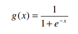
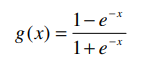
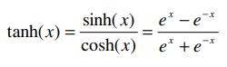
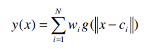
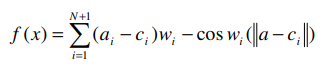

## Development of a convolution neural network for the classification of Alzheimer’s Dementia

**Abstract:** Alzheimer’s and Dementia patients are increasing each year due to increased average age of living. To help a greater amount of patients be diagnosed, a new neural network model will be created to classify stages of the Alzheimer’s Dementia. Leading to earlier treatment and management of the diseases. This study proposes the creation of a new neural network to be used for the classification of Alzheimer’s Dementia. The research creates a convolutional neural network for image classification using an Alzheimer’s data set containing pre-processed X-ray images. The research provides documentation for the design, implementation and evaluation for the creation of a neural network using pyTorch version 1.9.0. A study of the neural network model ”StackNet” presents a validation accuracy of 0.65 when classifying Alzheimer’s Dementia. Presenting an increased value of validation accuracy when compared to other models currently trained for image classification such as the base DenseNet model. Through research of literature there is a lack of research when using X-ray data-sets, thus this model currently trained using X-ray imaging as a method of classifying Alzheimer’s disease. 

Keywords: Convolutional neural network, Deep learning, Neuroimaging, X-ray imaging, Modularity, Machine learning

### 1.1 Introduction

A core saying within the medical field is ”Prevention is better than cure”. Where this project does not aim to prevent Alzheimer’s Dementia from occurring. To adhere to this statement and attempt to create a better life for those suffering from medical conditions, this study will be focused on the early detection of Alzheimer’s Dementia disease. The study will create a new system which uses deep learning to identify and classify medical images (1) for the purpose of identifying possible cases of Dementia and Alzheimer’s earlier than current methods (2). Allowing the patients to get faster treatment and management of the condition to improve their quality of life. The project will aim towards the creation of a new neural network which will classify images of Alzheimer’s which can be used as a form of early detection in aid of what currently exists. Through the use of a literature review, project time plan, design, implementation and evaluation of the project.

This article is broken down into three sections. A summarised literature review will be conducted to prepare for the project and understand concepts and techniques to be used within the product development. Using studies such as (3) and (4) to understand more about current methods of classification and applications of deep learning when using biological data. Following this will be a design of the proposed system. This will lead onto the implementation of the general user interface (GUI), architecture of the neural network and changes required. The report will conclude with an evaluation of the results and a discussion presented of the findings. This will then entail further study that can be followed on from the completion of this study.

### 1.2 Related Literature

This paper will review the literature and research specifically into Alzheimer’s and Dementia mental health diseases alongside AI developments which aid the prognosis of these diseases.
#### Introduction to Dementia
Dementia is classified as a syndrome typically caused by a decline of brain functions (5). Research shows ”One in fourteen over the age of 65 have dementia”(5), with this number increasing due to the average age of living increasing. Many symptoms of this disease are visible due to the brains loss of functionality, therefore typically patients with this condition will have memory loss and reduced motor skills in all aspects of their body known as neuro-psychiatric symptoms (6) e.g. Speech, all forms of movement, judgement skills and mental understanding. In conjunction with brain scans such as tomographic scans (CT)(7) and magnetic resonance imaging (MRI)(8) it is possible to quantify the severity of a case of dementia. Using these techniques it is also possible to gather an understanding of the rate of progression the disease has on the patient. By training an AI to notice these patterns and stages of the disease it is possible to identify possible cases of dementia at an earlier stage.
#### Introduction to Alzheimer’s
Alzheimer’s is a physical disease that affects the brain and is the most common cause of dementia (9). Alzheimer’s will cause a build up of proteins which causes the build up of harmful structures called plaques and tangles (9). These structures cause damage to nerve cells and brain tissue.
#### Brain Scan Techniques
Different types of scans can be used to analyse the severity of neurodegenerative disease within the patient. These scans can focus on different tissues and cell types within the body to offer a different viewpoint on the progression of the disease. 

Scans using positron emission tomography (PET) can be used to identify stages of the disease in patients presenting mild cognitive impairment (MCI) (10). PET uses in vivo amyloid imaging agents to highlight areas of the brain by quantifying the amount of amyloid-B protein (11).

Fluorodeoxyglucose(FDG)-PET (FDG-PET) scans are used to monitor changes within glucose metabolism and blood flow within the brain (12).

Structural MRI monitors tissue changes by looking at the grey and white matter. This scan can help the early diagnosis of potential symptoms of Alzheimer’s by seeing which area of the brain is being affected by tissue atrophy. This can also help slow the disease by targeting drugs for specific area’s or functions of the brain (13).

Diffusion tensor imaging is used to assess micro-structural brain changes by looking at the white matter fibre tracts (14). This can be used to gather a fractional anisotropy (FA) value (15) which will aid in prognosis of brain functionality.

Functional MRI (fMRI) (16) uses the blood-oxygen-level-dependant signal to measure blood oxygenation levels and blood flow. This can be used to assess changes in neural activity and changes in task related neural activity (17).

Research shows that multiple types of scans within conjunction of each other can lead to a greater understanding of the progression of the disease, this is known as multi-modal imaging. Allowing for cellular events to be monitored simultaneously (18). By keeping records of different activities within the brain, as well as recording any abnormalities at that particular stage of the disease, a greater understanding will be developed of changes which occur to progress Alzheimer’s into a more severe stage of the disease.

#### Introduction to Image Classification
Image classification in deep learning is a supervised learning problem. By defininga set of classes which are the objects to identify within the image, this is then used to train a model to recognise them using labelled example photos (1).Brain scans from different stages of Dementia and Alzheimer’s in the learning stage of image classification which would then be arranged into individual classes. This would then setan example for a new image to be inputted and placed into one of those set classes. The precision and  accuracy of this would depend on the quantity of brain scans available for study. (19) states how problems with current models can occur as poorestimates of classifier parameters (due to number of training samples) can result in low labelling accuracy and incorrect generalisation properties. Within image classification there are three types, these are supervised learning, unsupervised learningand object-based image analysis (OBIA) (20).

1. Unsupervised learning entails different techniques which are used to generateclusters from the image are K-means clustering (21), ISODATA clustering (22)and expectation-maximisation (23). The core feature of unsupervised learning isthat there is no requirement for samples.
2. OBIAtakes pixels from the data and arranges them into groups of objects, thesecan be based on spectral similarity or other external variables (24). There are two core segmentation algorithms developed for this being, eCognition (25) andArcGIS (26).
3. Supervised learning uses different methods such as maximum-likelihood (BayesianClassifier) (27). This technique uses data samples to create a training site, this data is labelled for training purposes. New data is then classified compared to the training samples to be given a weight from 0-1, this uses the process of probability distribution (28) to assess the weight assigned. Supervised learning can alsobe incorporated into other techniques to create a variant of supervised learningsuch as semi-supervised learning (29).

#### Neural Network Types
Convolution neural network (CNN):This is a deep learning method or algorithm which takes in an input (typically an image) and assigns to it various weights andbias to features within the image (30). These feature are able to be differentiated from each other. Compared to other classification algorithms pre-processing is required less withing a convolution network. Within a convolution layer not all nodes are connected to each other, each node only relates to the neighbouring nodes. They also get smaller as passed on through the network due to shrinking from dividing from the input factor. Pooling layers are used to filter out details, this is done bydown sampling a feature map, completed by summarising the features in areas ofthe feature map (31).

Artificial neural network (ANN):ANN’s are a deep learning algorithm which areable to learn non linear functions, also known as universal function approximators(UFA) (32). Similar to a CNN they have the capability to learn weights that mapthe input to an output. A core feature of the ANN is the activation function. This introduces non linear properties into the network, helping it learn complex relation-ships between input and output.

Recurrent Neural Networks (RNN):The RNN is very similar to an ANN, however on its hidden layers it has a looping constraint to ensure sequential information is captured in the input data. RNN’s primary method is parameter sharing, this shares the parameters across different time steps of the network. This method reduces the over all required parameters needed to train the network, decreasing the computationcost of training.

#### Activation Sequences
There are different forms of activation functions which can be used, most com-monly being uni-polar sigmoid function, bi-polar sigmoid function, hyperbolic tangent function, radial basis function and concic section function (33).

The Unipolar sigmoid function is derived using Equation 1.1 which is also known as the sigmoid function. This maps the input values to a range of [0,1]. This rangerepresents the probability of the output belonging to a specific class.

 (1.1)

Equation 1.2 presents the Bi-polar sigmoid function. This function is commonly used within a Hopfield neual network (34). This type of activation function is bestused within applications which present an output value with a range of [-1,1]. Hav-ing this range of output denotes it as being a bounded function.

 (1.2)

Equation 1.3 represents the hyperbolic tangent function also known as ’Tanh’. This function is similar to the bipolar sigmoid function presenting the same shape, as it also outputs with a range of [-1,1]. However the Tanh function presents a steeper sloped curve due to a factor of ’2x’ being used when taking the derivative (35).

 (1.3)

The radial basis function as presented in equation 1.4, is a function where thevalue depends on the distance from the origin. It is commonly used in radial basis function networks where data is required to be classified in non linear ways (36).

 (1.4)

The conic section function represented in equation 1.5 a section of a cone. This takes a parameter determining the angular value of the function (33).

 (1.5)

Neural networks rarely differ the activation function throughout the network. The hyperbolic tangent function is most commonly used at this period of time, primarily due to greater efficiency (37). However both the sigmoid functions and hyperbolic tangent function create networks which are more susceptible to the vanishing gradient problem (38).

#### Development of deep learning neural networks (DLNN)
DLNN’s are composed of artificial neurons or nodes which are represented with layers  within  the  model.  The  model  will  always  have  an  input  layer  and  output layer. The number of layers in between can vary dependant on the information youare trying to process as well as the complexity of the problem it is attempting to solve(39). For development of AI deep learning systems there are many languages which can be used to code with, these are primarily: Python (40), C++ (41), C, Java (42),JavaScript, Matlab (43) and C#. There are many different integrated development environments (IDE) for the development of AI. For Python the most common andtested IDE’s are PyCharm (44), Spyder (45) or Visual Studio Code (46).

#### Deep learning in medical practise
One highly researched area is its implementation into the healthcare industry. Anysystem which can reduce human error, save costs, increase efficiency and reduce stress for patients and staff in managing, diagnosing or treating illness is beneficial to the healthcare system (47). The application of deep learning has been widely noticed as there have been hundreds of papers applying deep learning models fordifferent aspects of medical image analysis shown by Litjens et al. (48).

#### Models and architecture
Convolution Neural Network (CNN): A CNN is suitable to process data withinarrays, this can include medical imaging. The CNN consists of three types of layer(49). The convoloutional layer, which detects similarities from the previous layer.The pooling layer, which will shift variance by reducing resolution of the featuremap. This layer is placed between two convoloutional layers. The fully connectedlayer, which will perform reasoning by taking in all neurons from the previous layerand  connecting them to all  neurons on the current layer (50). A core feature of using a CNN is the ability to automatically detect important features without humaninteraction. However to achieve reliable results using this model method a largetraining data set is required.

Synergic Deep Learning (SLD): This model uses multiple CNN’s at the sametime in an attempt for them to learn from each other. This presents the theory that if one CNN will create a correct classification and another makes an incorrect classification a ’synergic error’ will occur which will force an update in the model (51). Advantages of this model are that multiple CNN’s can cross check and learn fromeach other potentially increasing the precision of results. On the other hand this model is still experimental and has not had a large quantity of studies to prove the effectiveness and reliability of this model.

InceptionV3: This model was designed and created as a focus on reducing theamount of computational power required (52). Advantages of using this model is required potential computational power required when running the system. However that computational power reduction is potentially lost when modifying the network. As changes to the network will result in uncertain outcome. Therefore if modifications are required to the network it is not advised to use this model. There are developments to improve flexibility in this network by using techniques such as factorised convolutions, regularisation, dimension reduction and parallelized computations.

Xception: This model was inspired by InceptionV3 and is similar as it uses thesame number of parameters and architecture within the model. The model gains performance through the use of more efficient model parameters (53). Another study done by - (54) shows an increased accuracy rating for prediction in conjunction withusing googles ’Swish activation function’ while using this model. More research would be required to understand the benefits of using this model with other data sets of varied complexity.

VGG16 and VGG19:This network uses a three by three set of convoloutional layers stacked on top of each other (55). The 16 and 19 representing the number of weight layers within the network. By using smaller networks which are converged and used as initialisations for deeper networks. These smaller networks create aprocess called pre-training. This use of pre-training can increase the optimisation of the network (56). However this pre-training network is typically unsupervised(57), this may have an undesired outcome on the following data. More studies arerequired to see the effect of supervised pre-training.

ResNet50: This originated from Residual Network (ResNet) (58), the modelaims to create a framework which will aim to improve the training of networks.ResNet was created to combat against the degradation problem which occurs whenmore depth in networks cause accuracy to decrease, by using a technique called residual mapping. ResNet performs better with deeper architecture. An advantage of using this model is ease of implementation with open sources such as PyTorch and Tensorflow, both coming with in depth tutorials on development and alteration of the model. The model has further been updated with different iterations such as Wide ResNet, further study will have to be research to identify the specific areas ofdifference when deciding to use different iterations of the model.

DenseNet:Within DenseNet each layer of the network obtains additional inputfrom the previous layers and passes on the feature map. This uses the techniqueof concatenation which allows each layer to receive a collective knowledge basefrom previous layers. An advantage of using this network model is computation andmemory efficiency. There are also variants of this network model such as multiplefeature re-weight DenseNet (MFR-DenseNet) (59), this variability and customisa-tion within the network is advantageous when designing a new deep learning model.

MobileNet:This network was developed for use with Keras. The network usesdepth wise separable convolution as the base unit. This has two layers, a depth wise convolution and point convolution. By using this it reduces the amount of parameters needed compared to other network models. Similar to other network models here is also the option of using pre-trained weights from sources such as ImageNet(60). This is typically designed for use in mobile and embedded vision applications.

NASNet: This model is  designed by Google as an automatic machine learn-ing structure to produce small neural networks. The model is primarily focused onobject detection networks. Due to the limited access to NASNet and little studies conducted on the testing of its capabilities. The major project linked to this paper will not use this network model.

#### Deep learning in relation to Dementia disease
Vascular Dementia: Typically caused by reduced of blood flow to the brain, fromblood vessels dying (65). Therefore CT scan and MRI scans are currently done to aid diagnosis of this type of Dementia, as they can identify changes in white matter within the brain. There are few studies which show the possibilities of using deeplearning to identify vascular dementia, however (66) does show how a model specif-ically built for the recognition and analysis of condition states of Vascular Dementiacan yield significant results compared to the predictive capability of human testers. As mentioned before more studies will need to be conducted on this to prove there liability and accuracy of the study. The base ANN model used within this studywas ’Chainer’ (67).

Dementia with lewy bodies (DLB): Typically caused by deposits of alpha-synuclein proteins in the nerve cells of the brain (68). Currently the main tech-niques used to diagnose DLB relate to observing the patient during mental ability tests, typical features of this include: rapid eye movement sleep behaviour disorder, persistent detailed visual hallucinations and movement problems similar to those of Parkinson’s disease (69) (70). Thus CT and MRI scans are only used as clarifica-tion of diagnosis, rather than standalone evidence. Unless the deep learning model is able to classify videos of patients as well as the brain scans it may prove to behard to have a deep learning model to diagnose this type of Dementia. Studies suchas (71) and (72) have shown that deep learning can classify the different of this type of Dementia from another. However, this is not early detection.

Frontotemporal Dementia (FTD):This can be broken down into two subsec-tions, behavioural variant FTD (BVFTD) and primary progressive aphasia (PPA). BVFTD occurs when there is damage to the fontal lobes, causing behaviour and per-sonality changes (73). PPA occurs when there is damage to the temporal lobes, typi-cally causing language problems (74). There is evidence of AI being used alongside clinical judgement to better diagnose patients presenting this condition as shown by(75). However during the time of literature being reviewed there is no stand alone AI which is able to identify FTD without clinical judgement incorporated. This leaves area of study to be done, where an AI is developed which can create an analysis andcategorisation from videos as well as static brain images.

Mixed Dementia: This form of Dementia presents itself as multiple forms of Dementia at the same time. As such an AI will not be able to detect ”Mixed Demen-tia”, instead it would identify that the patient will have a form of Dementia, then another AI would be able to classify the type of Dementia that is present. There is currently no evidence of deep learning used to identify specifically mixed Dementia.

