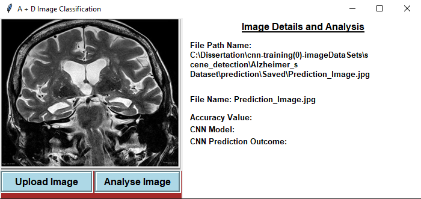
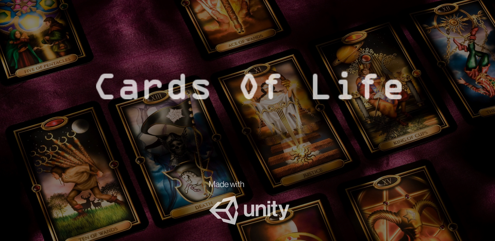
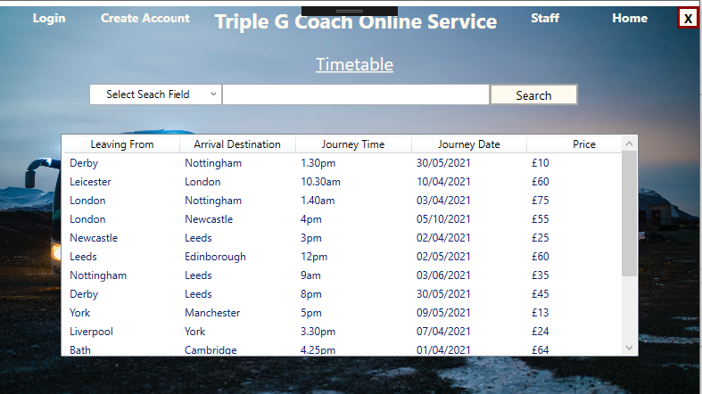
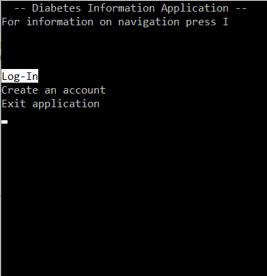
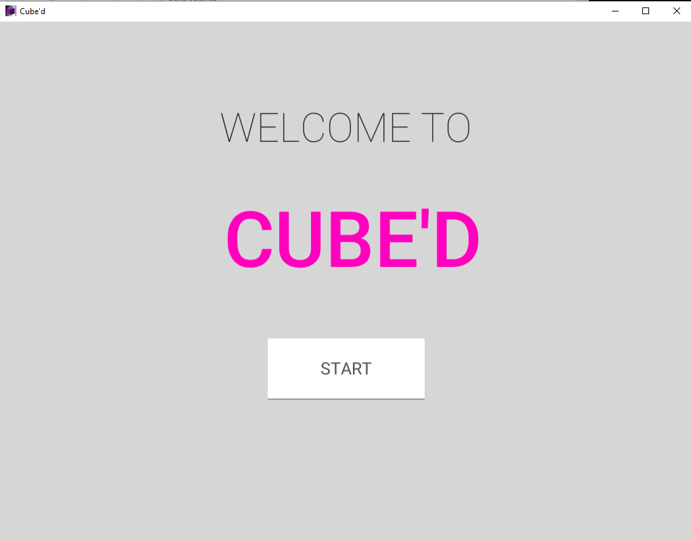
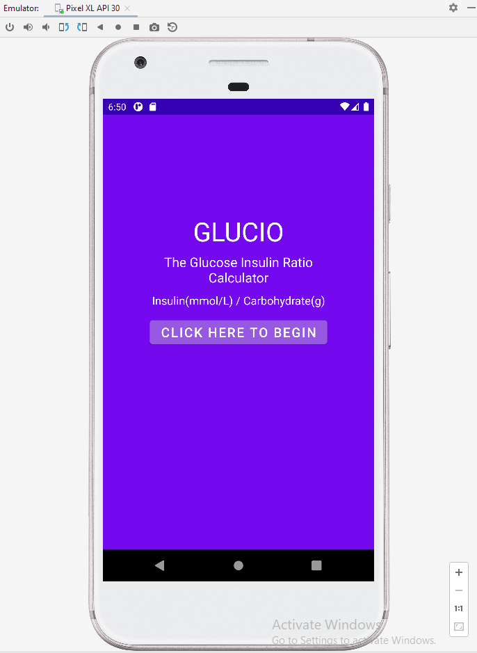
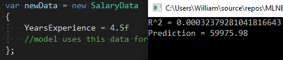

## Portfolio
Welcome! I am an aspiring programmer aiming to develop my skills. Currently finishing an MSc in Computing Systems. Looking for work within game programming / software development / software engineering / software programming / AI programming / full stack development.

Click my name to navigate back to this home page.

Select a project for a detailed view. 

---

### Projects

[Project: Alzheimer's Classification AI](/AlzheimersClassificationAIPage)

---

[Project: Cards Of Life](/CardsOfLifePage)

---
[Project:Triple G Coach Service](/TripleGPage)

---
[Project: Type 1 Diabetes Management Console Applicaiton](/DMConsoleAppPage)

---

[Project: Cube'd](/CubedPage)

---

[Project: Glucio](/GlucioPage)

---

[Project: Salary prediction](/MLSalaryPrediction)

---

[Poject: Bundle of Small Projects](/SmallProjectsPage)

This page includes small projects put together
